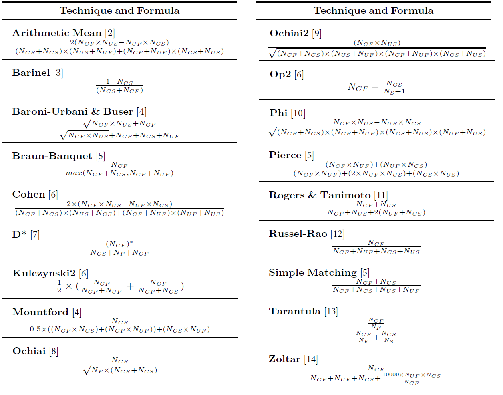

There are several techniques proposed in the literature for suspiciousness computation. In this work we study how effective they are in the context of model transformation verification, i.e., how helpful they are in finding the faulty transformation rule. For this, we have surveyed papers that apply SBFL in different contexts and have selected the same 18 techniques that were collected in [1]. Each technique is displayed with the corresponding suspiciousness computation formulae in the table displayed below.

As described in [1], *Tarantula* [13] is one of the best-known fault localization techniques. It follows the intuition that statements that are executed primarily by more failed test cases are highly likely to be faulty. Additionally, statements that are executed primarily by more successful test cases are less likely to be faulty. The *Ochiai* similarity coefficient is known from the biology domain and it has been proved to outperform several other coefficients used in fault localization and data clustering [8]. This can be attributed to the Ochiai coefficient being more sensitive to activity of potential fault locations in failed runs than to activity in passed runs.
*Ochiai2* is an extension of this technique [5, 6, 9]. *Kulczynski2*, taken from the field of artificial intelligence, and *Cohen* have showed promising results in preliminary experiments [2, 6]. *Russel-Rao* has shown different results in previous experiments [2, 12, 15], while *Simple Matching* has been used in clustering [6].
*Reogers & Tanimoto* presented a high similarity with *Simple Matching* when ranking in the study performed in [6]. The framework called *Barinel* [3] combines spectrum-based fault localization and model-based debugging to localize single and multiple bugs in programs. Zoltar [14] is also a tool set for fault localization.
*Arithmetic Mean*, *Phi* (Geometric Mean), *Op2* and *Pierce* have been considered in some comparative studies with other metrics [2, 5, 6]. *Mountford* behaves as the second best technique, among 17 of them, for a specific program in a study performed in [4], where *Baroni-Urbani & Buser* is also studied. As for *D**, its numerator, *(N_{CF})^{*})*, depends on the value of "*" selected. This technique was the best technique in the study performed in~\cite{WongDGL14} when "*" was assigned a value of 2.
We have followed the same approach, so we have *(N_{CF})^{2})* in the numerator of the formula for the *D** technique.

Note that the computation of these formulae may result in having zero in the denominator.Different approaches mention how to deal with such cases [16, 17, 18]. Following the guidelines of these works, if a denominator is zero and the numerator is also zero, our computation returns zero. However, if the numerator is not 0, then it returns 1 [16].

The notatoin shown in the formulae is the following:  
*Ncf*: number of failed PCs exercising the rule  
*Nuf*: number of failed PCs not exercising the rule  
*Ncs*: number of successful PCs exercising the rule  
*Nus*: number of successful PCs not exercising the rule  
*Nc*: number of PCs exercising the rule  
*Nu*: number of PCs not exercising the rule  
*Ns*: number of successful PCs  
*Nf*: number of failed PCs  

